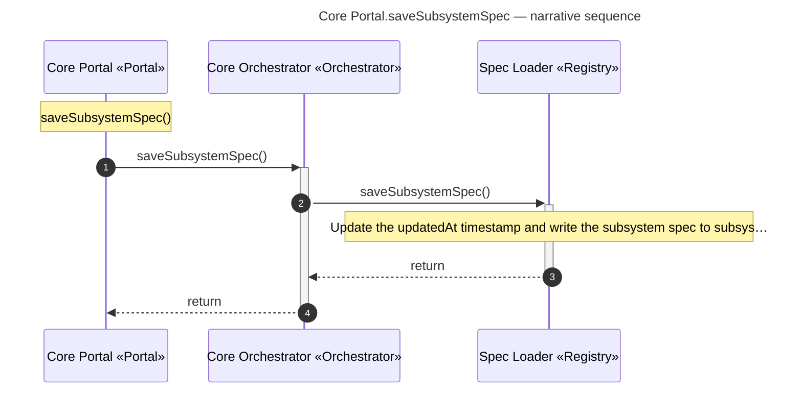

# Core Portal.saveSubsystemSpec — narrative sequence

> Generated by `wairon diagram` from `.wai/specs/` — do not edit; regenerate instead.

```mermaid
---
title: "Core Portal.saveSubsystemSpec — narrative sequence"
---
sequenceDiagram
  autonumber
  participant core_portal as Core Portal «Portal»
  Note over core_portal: saveSubsystemSpec()
  participant core_orchestrator as Core Orchestrator «Orchestrator»
  core_portal->>+core_orchestrator: saveSubsystemSpec()
  participant spec_loader as Spec Loader «Registry»
  core_orchestrator->>+spec_loader: saveSubsystemSpec()
  Note over spec_loader: Update the updatedAt timestamp and write the subsystem spec to subsys…
  spec_loader-->>-core_orchestrator: return
  core_orchestrator-->>-core_portal: return
```
