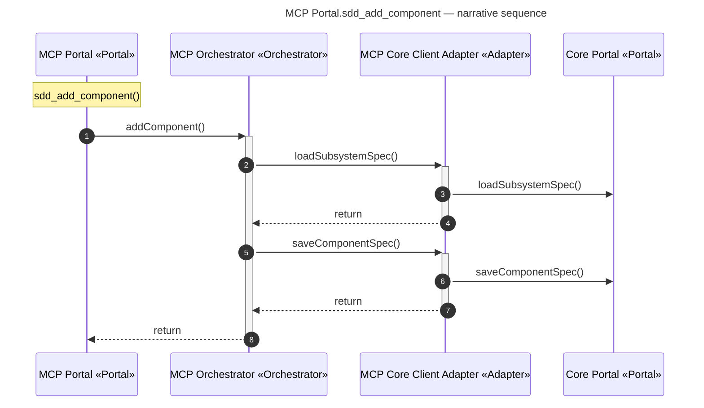

# MCP Portal.sdd_add_component — narrative sequence

> Generated by `wairon diagram` from `.wai/specs/` — do not edit; regenerate instead.

```mermaid
---
title: "MCP Portal.sdd_add_component — narrative sequence"
---
sequenceDiagram
  autonumber
  participant mcp_portal as MCP Portal «Portal»
  Note over mcp_portal: sdd_add_component()
  participant mcp_orchestrator as MCP Orchestrator «Orchestrator»
  mcp_portal->>+mcp_orchestrator: addComponent()
  participant mcp_core_adapter as MCP Core Client Adapter «Adapter»
  mcp_orchestrator->>+mcp_core_adapter: loadSubsystemSpec()
  participant core_portal as Core Portal «Portal»
  mcp_core_adapter->>core_portal: loadSubsystemSpec()
  mcp_core_adapter-->>-mcp_orchestrator: return
  mcp_orchestrator->>+mcp_core_adapter: saveComponentSpec()
  mcp_core_adapter->>core_portal: saveComponentSpec()
  mcp_core_adapter-->>-mcp_orchestrator: return
  mcp_orchestrator-->>-mcp_portal: return
```
