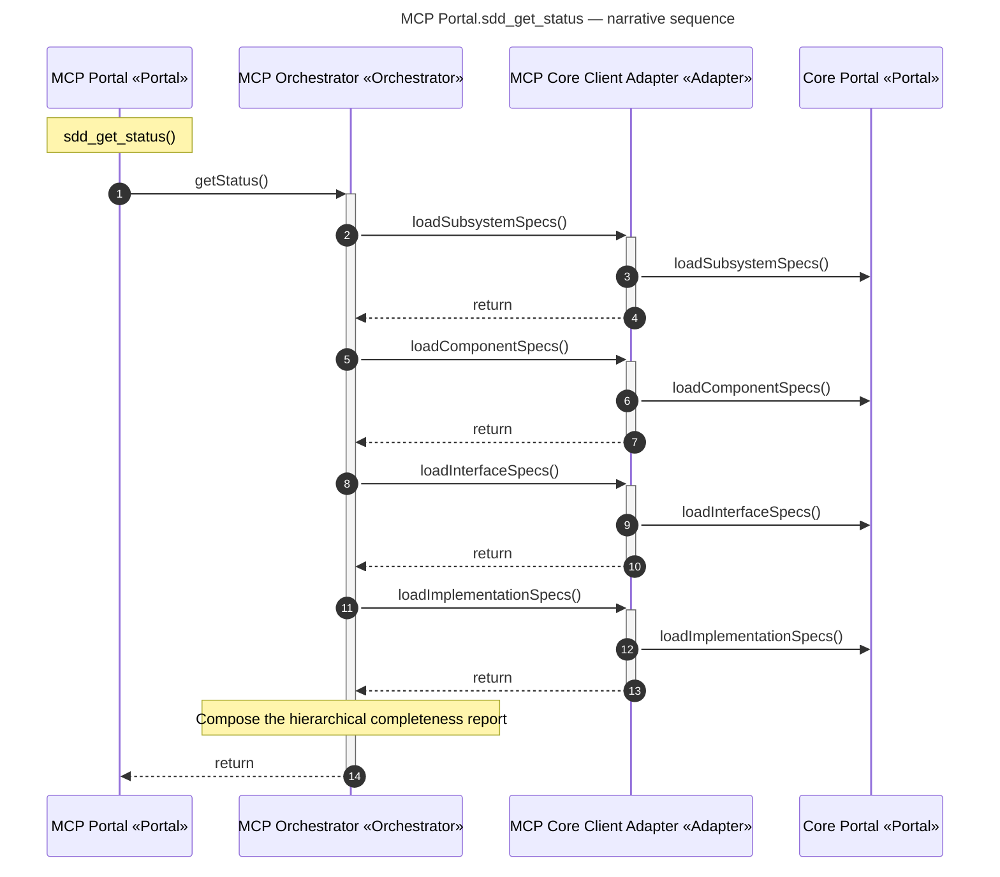

# MCP Portal.sdd_get_status — narrative sequence

> Generated by `wairon diagram` from `.wai/specs/` — do not edit; regenerate instead.

```mermaid
---
title: "MCP Portal.sdd_get_status — narrative sequence"
---
sequenceDiagram
  autonumber
  participant mcp_portal as MCP Portal «Portal»
  Note over mcp_portal: sdd_get_status()
  participant mcp_orchestrator as MCP Orchestrator «Orchestrator»
  mcp_portal->>+mcp_orchestrator: getStatus()
  participant mcp_core_adapter as MCP Core Client Adapter «Adapter»
  mcp_orchestrator->>+mcp_core_adapter: loadSubsystemSpecs()
  participant core_portal as Core Portal «Portal»
  mcp_core_adapter->>core_portal: loadSubsystemSpecs()
  mcp_core_adapter-->>-mcp_orchestrator: return
  mcp_orchestrator->>+mcp_core_adapter: loadComponentSpecs()
  mcp_core_adapter->>core_portal: loadComponentSpecs()
  mcp_core_adapter-->>-mcp_orchestrator: return
  mcp_orchestrator->>+mcp_core_adapter: loadInterfaceSpecs()
  mcp_core_adapter->>core_portal: loadInterfaceSpecs()
  mcp_core_adapter-->>-mcp_orchestrator: return
  mcp_orchestrator->>+mcp_core_adapter: loadImplementationSpecs()
  mcp_core_adapter->>core_portal: loadImplementationSpecs()
  mcp_core_adapter-->>-mcp_orchestrator: return
  Note over mcp_orchestrator: Compose the hierarchical completeness report
  mcp_orchestrator-->>-mcp_portal: return
```
