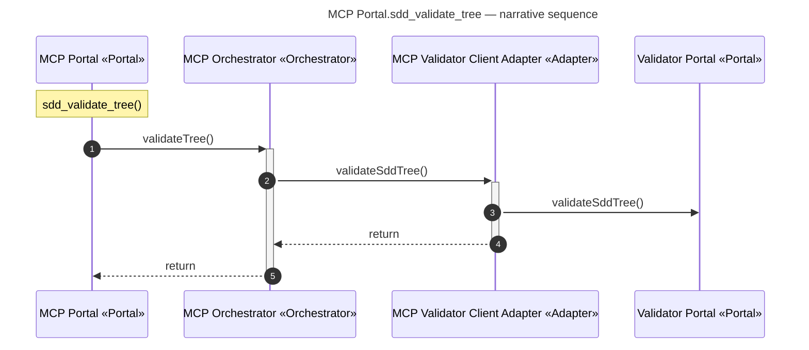

# MCP Portal.sdd_validate_tree — narrative sequence

> Generated by `wairon diagram` from `.wai/specs/` — do not edit; regenerate instead.

```mermaid
---
title: "MCP Portal.sdd_validate_tree — narrative sequence"
---
sequenceDiagram
  autonumber
  participant mcp_portal as MCP Portal «Portal»
  Note over mcp_portal: sdd_validate_tree()
  participant mcp_orchestrator as MCP Orchestrator «Orchestrator»
  mcp_portal->>+mcp_orchestrator: validateTree()
  participant mcp_validator_adapter as MCP Validator Client Adapter «Adapter»
  mcp_orchestrator->>+mcp_validator_adapter: validateSddTree()
  participant validator_portal as Validator Portal «Portal»
  mcp_validator_adapter->>validator_portal: validateSddTree()
  mcp_validator_adapter-->>-mcp_orchestrator: return
  mcp_orchestrator-->>-mcp_portal: return
```
