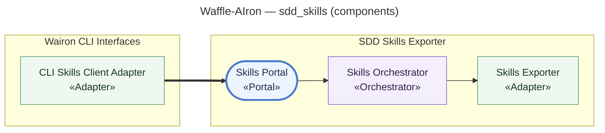

# SDD Skills Exporter — components

> Generated by `wairon diagram` from `.wai/specs/` — do not edit; regenerate instead.

```mermaid
---
title: "Waffle-AIron — sdd_skills (components)"
---
flowchart LR
  subgraph sub_sdd_skills["SDD Skills Exporter"]
    skills_exporter["Skills Exporter<br/>«Adapter»"]
    skills_orchestrator["Skills Orchestrator<br/>«Orchestrator»"]
    skills_portal(["Skills Portal<br/>«Portal»"])
  end
  subgraph sub_sdd_cli["Wairon CLI Interfaces"]
    cli_skills_adapter["CLI Skills Client Adapter<br/>«Adapter»"]
  end
  skills_orchestrator --> skills_exporter
  skills_portal --> skills_orchestrator
  cli_skills_adapter ==> skills_portal

  classDef entry fill:#eef4ff,stroke:#4a7dcf,color:#1a2b4a;
  classDef logic fill:#f4effd,stroke:#8a63c9,color:#2d1f45;
  classDef data fill:#fdf6e3,stroke:#c9963f,color:#4a3517;
  classDef adapter fill:#eef8f1,stroke:#4f9e6b,color:#173322;
  classDef pattern fill:#f6f8fa,stroke:#6a737d,color:#24292e;
  classDef publicSurface stroke-width:3px;
  class skills_exporter,cli_skills_adapter adapter
  class skills_orchestrator logic
  class skills_portal entry
  class skills_portal publicSurface
```
