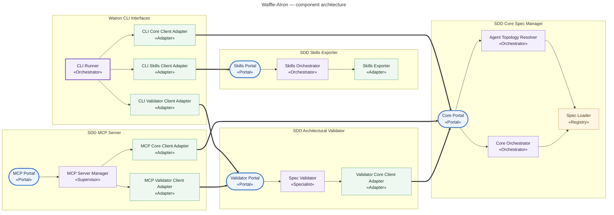

# Waffle-AIron — component architecture

> Generated by `wairon diagram` from `.wai/specs/` — do not edit; regenerate instead.

```mermaid
---
title: "Waffle-AIron — component architecture"
---
flowchart LR
  subgraph sub_sdd_core["SDD Core Spec Manager"]
    agent_resolver["Agent Topology Resolver<br/>«Orchestrator»"]
    core_orchestrator["Core Orchestrator<br/>«Orchestrator»"]
    core_portal(["Core Portal<br/>«Portal»"])
    spec_loader["Spec Loader<br/>«Registry»"]
  end
  subgraph sub_sdd_cli["Wairon CLI Interfaces"]
    cli_core_adapter["CLI Core Client Adapter<br/>«Adapter»"]
    cli_runner["CLI Runner<br/>«Orchestrator»"]
    cli_skills_adapter["CLI Skills Client Adapter<br/>«Adapter»"]
    cli_validator_adapter["CLI Validator Client Adapter<br/>«Adapter»"]
  end
  subgraph sub_sdd_mcp["SDD MCP Server"]
    mcp_core_adapter["MCP Core Client Adapter<br/>«Adapter»"]
    mcp_portal(["MCP Portal<br/>«Portal»"])
    mcp_server["MCP Server Manager<br/>«Supervisor»"]
    mcp_validator_adapter["MCP Validator Client Adapter<br/>«Adapter»"]
  end
  subgraph sub_sdd_skills["SDD Skills Exporter"]
    skills_exporter["Skills Exporter<br/>«Adapter»"]
    skills_orchestrator["Skills Orchestrator<br/>«Orchestrator»"]
    skills_portal(["Skills Portal<br/>«Portal»"])
  end
  subgraph sub_sdd_validator["SDD Architectural Validator"]
    spec_validator["Spec Validator<br/>«Specialist»"]
    validator_core_adapter["Validator Core Client Adapter<br/>«Adapter»"]
    validator_portal(["Validator Portal<br/>«Portal»"])
  end
  agent_resolver --> spec_loader
  cli_core_adapter ==> core_portal
  cli_runner --> cli_core_adapter
  cli_runner --> cli_validator_adapter
  cli_runner --> cli_skills_adapter
  cli_skills_adapter ==> skills_portal
  cli_validator_adapter ==> validator_portal
  core_orchestrator --> spec_loader
  core_portal --> agent_resolver
  core_portal --> core_orchestrator
  mcp_core_adapter ==> core_portal
  mcp_portal --> mcp_server
  mcp_server --> mcp_core_adapter
  mcp_server --> mcp_validator_adapter
  mcp_validator_adapter ==> validator_portal
  skills_orchestrator --> skills_exporter
  skills_portal --> skills_orchestrator
  spec_validator --> validator_core_adapter
  validator_core_adapter ==> core_portal
  validator_portal --> spec_validator

  classDef entry fill:#eef4ff,stroke:#4a7dcf,color:#1a2b4a;
  classDef logic fill:#f4effd,stroke:#8a63c9,color:#2d1f45;
  classDef data fill:#fdf6e3,stroke:#c9963f,color:#4a3517;
  classDef adapter fill:#eef8f1,stroke:#4f9e6b,color:#173322;
  classDef pattern fill:#f6f8fa,stroke:#6a737d,color:#24292e;
  classDef publicSurface stroke-width:3px;
  class agent_resolver,core_orchestrator,cli_runner,mcp_server,skills_orchestrator,spec_validator logic
  class core_portal,mcp_portal,skills_portal,validator_portal entry
  class core_portal,cli_runner,mcp_portal,skills_portal,validator_portal publicSurface
  class spec_loader data
  class cli_core_adapter,cli_skills_adapter,cli_validator_adapter,mcp_core_adapter,mcp_validator_adapter,skills_exporter,validator_core_adapter adapter
```
