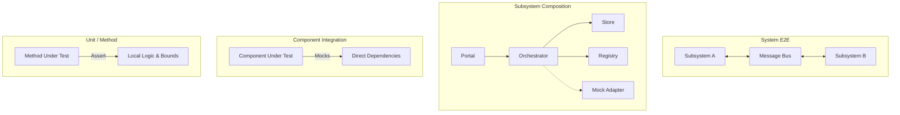

# Spec-Driven Testing Standards & Lifecycle

**Version:** 1.0 · **Date:** 2026-06-14

This document defines the architecture and standards for testing in Waffler. It outlines the multi-level testing hierarchy, automated mocking rules, and the Spec-Driven Test-Driven Development (SDD-TDD) loop required for all components.

Read this together with:
- `05_CODING_STANDARDS.md`
- `14_COMPONENT_BUILDING_BLOCKS.md`
- `16_SPEC_DRIVEN_DEVELOPMENT.md`

---

## 📐 The Testing Abstraction Hierarchy

Waffler enforces testing at four distinct abstraction levels, mapping directly to the SDD Spec Tree layers:



### 1. Level 1: Unit / Method Testing
*   **Target:** Individual methods defined in L3 Interface contracts.
*   **Scope:** Pure local logic, data formatting, validation boundaries, and edge cases.
*   **Rule:** 100% path coverage is required. Every branching statement (`if`, `match`, `Result` mapping) must have a corresponding test case.
*   **Error Paths:** Tests *must* assert correct error types and messages when bad inputs are provided or invariants are violated.

### 2. Level 2: Component Integration Testing
*   **Target:** A single L2 Component stereotype (Orchestrator, Store, Registry, Specialist, etc.).
*   **Scope:** Verifies the component's internal coordination logic, state mutations, and interaction with direct dependencies.
*   **Mocking:** Every direct L2 dependency listed in `component.yaml` **must be mocked** using auto-generated interface mocks. No real database, VFS, or network calls are allowed at this level.
*   **Rule:** Test assertions must verify not only the returned value, but also that dependency methods were called with the correct parameters in the correct sequence (matching the L5 Narrative steps).

### 3. Level 3: Subsystem Composition Testing
*   **Target:** An L1 Subsystem boundary (e.g., `billing` or `customers`).
*   **Scope:** Verifies the orchestration flow from entry points (`Portal` or `Observer`) down to the data layers (`Store` or `Registry`) without mocking the internal components of the subsystem.
*   **Mocking:** Internal components (Orchestrators, Stores, Registries, Specialists) are real. External boundaries (external Subsystems, third-party APIs, database connections) are mocked at the Subsystem adapter layer.
*   **Rule:** Verifies that commands sent to the Portal trigger the expected state mutations in the Store and publish the correct event notifications on success.

### 4. Level 4: System End-to-End Testing
*   **Target:** The entire L0 System (`system.yaml`).
*   **Scope:** Verifies multi-subsystem workflows and event propagation across the global Message Bus.
*   **Mocking:** Minimally mocked. External third-party networks (e.g., Stripe API, SMTP server) are mocked using test servers (like WireMock or Stripe mock). Databases and VFS states are populated with clean test registries.
*   **Rule:** Verifies that a lifecycle action starting in Subsystem A (e.g. customer signs up) successfully publishes an event, triggers Subsystem B (e.g. billing creates an account), and ends in the correct global state.

---

## 🤖 Automated Mocking Standards

Mocks are a first-class citizen in the spec tree. Because all component dependencies are explicitly declared in the spec, mock generators must output stubs matching the L3 interface contract exactly.

### Mock Generation Rules
1.  **Interface Adherence:** Every mock must implement the corresponding `interface.yaml` method signatures.
2.  **Call Inspection:** Mocks must track:
    - Number of times a method was called (`call_count`).
    - The exact arguments passed to each call (`captured_args`).
    - The order of calls across all mock methods.
3.  **Stubbing Control:** Mocks must allow tests to easily configure return values or simulate failures (e.g., `mock.set_return_value(value)` or `mock.simulate_error(error)`).

### Example: Auto-Generated Mock Stub (Rust Concept)
Given an L3 Interface `ibilling-store` with method `save(invoice_id, data)`:
```rust
// Auto-generated Mock
pub struct MockBillingStore {
    pub save_calls: Mutex<Vec<(String, InvoiceData)>>,
    pub return_value: Mutex<Result<(), WafflerError>>,
}

impl MockBillingStore {
    pub fn new() -> Self {
        Self {
            save_calls: Mutex::new(Vec::new()),
            return_value: Mutex::new(Ok(())),
        }
    }
}

// Implements L3 contract
#[async_trait]
impl IBillingStore for MockBillingStore {
    async fn save(&self, invoice_id: String, data: InvoiceData) -> Result<(), WafflerError> {
        self.save_calls.lock().unwrap().push((invoice_id, data));
        self.return_value.lock().unwrap().clone()
    }
}
```

---

## 🔄 The SDD-TDD AI Development Loop

To guarantee architectural perfection and prevent "vibe coding", the compilation of specifications into code follows a strict Test-Driven loop:

```
[Design Spec Approved]
        │
        ▼
1. Auto-scaffold Test Files & Mocks (wairon generate)
        │
        ▼
2. AI Agent refines Tests (Assert success + ALL error paths)
        │
        ▼
3. Run Test Suite -> [Verify Fail]
        │
        ▼
4. AI Agent writes Component Implementation
        │
        ▼
5. Run Test Suite -> [Verify Pass]
        │
        ▼
[Commit & Validate (wairon validate)]
```

### Strict Loop Rules
1.  **Test-First Implementation:** Under no circumstances should implementation code be written before the corresponding test suite is scaffolded.
2.  **Test All Invariants:** Tests must check:
    - **Success Paths:** Valid parameters return expected data and mutate state correctly.
    - **Boundaries:** Maximum/minimum values, empty arrays, null values.
    - **Error Paths:** Timeout failures, database connection errors, permission validation failures.
3.  **No Test Deletion:** If a generated test fails, the agent must fix the implementation to match the spec contract. The agent must *never* edit or delete test assertions to bypass failures unless the L3/L5 specification itself is modified and re-approved by the user.
